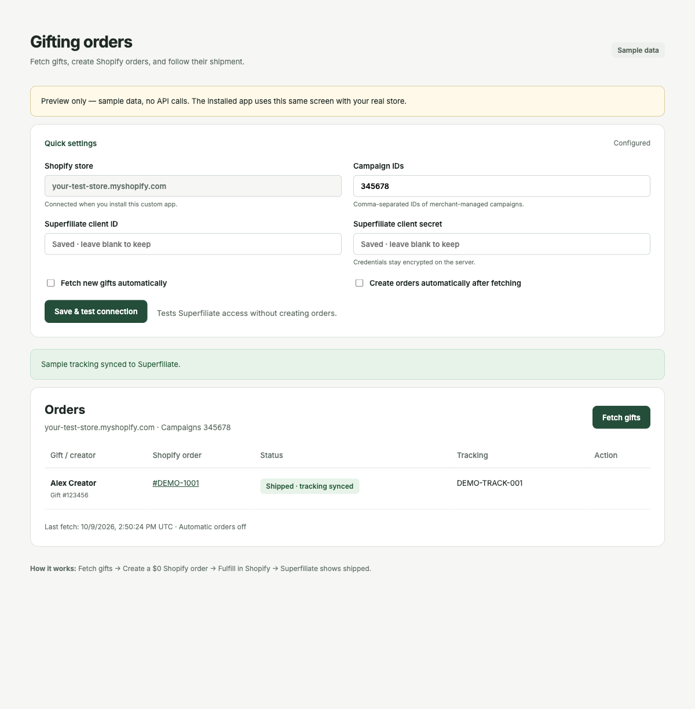
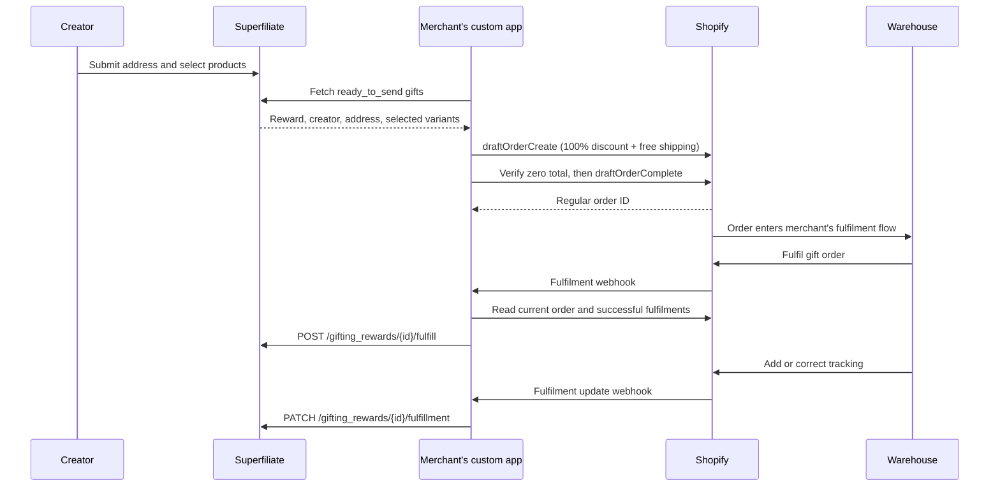

# Shopify gifting app demo

An open-source reference for **merchants building their own Shopify custom-distribution app**. Each merchant forks the code, registers their own app and hosts their own deployment. The source repository is public; the Shopify app uses `AppDistribution.SingleMerchant` and is installed through a custom install link.

The app reads submitted gifts from Superfiliate's merchant-managed gifting API, creates zero-total Shopify orders through draft orders, and sends shipment details back when the warehouse fulfils them.

## Try the fixture demo

No Shopify or Superfiliate credentials are needed. Docker runs Node and PostgreSQL locally:

```sh
docker compose up -d db dev
docker compose exec dev pnpm install
docker compose exec dev pnpm run setup
docker compose exec dev pnpm demo
```

Open **http://localhost:4510/demo**. Use Quick settings, Fetch gifts, Create order, and the simulated shipment/tracking controls. The preview and installed app share the same screen. All data is fictional; the demo does not call either API.

You can also open this repository as a Dev Container. Its setup installs dependencies and applies the database migration.



## How it works



The app keeps order creation separate from shipment. Superfiliate stays `ready_to_send` until Shopify reports the entire gift order fulfilled; the app's database prevents importing it again during that time. Shopify routes and physically fulfils the order through the merchant's existing warehouse or 3PL workflow. This app does not create a shipping label or mark an unshipped Shopify order fulfilled.

Polling imports new gifts every five minutes when enabled. By default, fetched gifts wait for **Create order**; Quick settings can enable automatic order creation. Once an order has started, pausing imports or automatic creation keeps its shipment reconciliation running. Failed manual fetches remain queued and retry after 30 seconds. Webhooks wake shipment reconciliation, and periodic order reads recover missed events. Pausing imports keeps existing shipment reconciliation running.

## Connect a merchant-owned app

1. Fork this repository into your own organization.
2. Create an app in the [Shopify Dev Dashboard](https://dev.shopify.com). Choose **Custom distribution**, generate an install link for your store and install it. Use your own app credentials, not Superfiliate's app credentials. Custom distribution supports one store, or stores within the same Plus organization; this sample intentionally configures one store per deployment.
3. Copy `.env.example` to `.env` and configure the values below. Never commit that file.
4. Link the CLI configuration to your app with `pnpm config:link` (inside the devcontainer: `docker compose exec dev pnpm config:link`). Retain the scopes and webhook subscriptions in `shopify.app.toml`; linking can replace that file.
5. Obtain Superfiliate Partner API credentials with `gifting_rewards.write` (which includes read access). These gifting endpoints currently require alpha access.
6. Configure one or more **merchant-managed** campaigns in `SF_CAMPAIGN_IDS`. You can set campaigns in Quick settings or through the environment. Assign this integration sole responsibility for those campaigns, and submit a test gift with a valid address and Shopify product selections.
7. Start `pnpm dev` and, in another terminal, `pnpm worker`. Open the installed app through Shopify admin. In **Quick settings**, enter your Superfiliate client ID, client secret and campaign IDs, then choose **Save & test connection**. Choose **Fetch gifts**, then **Create order** for a gift. Enable automatic fetching and/or automatic order creation when ready.

For the container workflow, use `docker compose exec dev` before each project command. Inside Docker, use `DATABASE_URL=postgresql://gifting:gifting@db:5432/gifting` in `.env`; outside Docker use the localhost URL in `.env.example`. Shopify CLI runs an HTTPS development tunnel. The web and worker processes need the same database and app configuration; copy the current tunnel URL to `.env` for the worker.

Shopify authentication and expiring offline tokens are managed by the official Shopify React Router library. On reinstall, a fresh poll restores redacted gifts only when order creation has never been attempted, preserving the duplicate-prevention guard. The authenticated UI and webhooks validate the configured `SHOPIFY_SHOP_DOMAIN`; the worker uses the saved offline session.

### Configuration

| Variable                                | Purpose                                                             |
| --------------------------------------- | ------------------------------------------------------------------- |
| `DATABASE_URL`                          | PostgreSQL shared by the web app and worker                         |
| `SHOPIFY_API_KEY`, `SHOPIFY_API_SECRET` | Your registered app's credentials                                   |
| `SHOPIFY_APP_URL`                       | Public HTTPS URL of your hosted app, or current development tunnel  |
| `SHOPIFY_SHOP_DOMAIN`                   | Exactly one `your-store.myshopify.com` domain                       |
| `SCOPES`                                | Same scopes as `shopify.app.toml`                                   |
| `SF_BASE_URL`                           | Superfiliate API origin; defaults to `https://api.superfiliate.com` |
| `SF_CLIENT_ID`, `SF_CLIENT_SECRET`      | Optional environment defaults; Quick settings can save credentials  |
| `SF_CAMPAIGN_IDS`                       | Comma-separated campaign IDs; Quick settings can override this      |
| `SF_TRACKING_UPDATES_ENABLED`           | Enable only after the companion tracking API is deployed            |
| `POLL_INTERVAL_SECONDS`                 | Import/reconciliation interval; defaults to 300, minimum 30         |

Shopify scopes are `write_draft_orders`, `read_orders`, `read_products` and `read_fulfillments`. Configure the customer-data access required by your app in the Dev Dashboard. The example uses recipient contact and shipping details to create drafts.

Selected variant external IDs must be numeric Shopify variant IDs or `gid://shopify/ProductVariant/...` values from this store. The app stops for review when IDs refer to another OMS or SKUs; add an explicit mapping for that use case. It never substitutes a custom line item that would bypass inventory tracking.

## Superfiliate API dependency

The current Partner API exposes:

- `GET /api/v1/gifting_rewards?gifting_stage=ready_to_send&campaign_id=...&items=250&page=...`
- `POST /api/v1/gifting_rewards/{id}/fulfill`

The first fulfilment request marks the reward `shipped`. Identical retries are accepted, but changing its tracking payload is rejected.

Late tracking updates need the **companion backend change**:

```http
PATCH /api/v1/gifting_rewards/{id}/fulfillment
Authorization: Bearer <client_id>:<client_secret>
Content-Type: application/json

{"carrier":"UPS","tracking_number":"TRACK-1","tracking_url":"https://example.com/TRACK-1"}
```

That endpoint requires `gifting_rewards.write`, preserves omitted fields, clears explicitly null fields, and preserves the shipment timestamp and reward stage. Until it is deployed, leave `SF_TRACKING_UPDATES_ENABLED=false`. Initial fulfilment still works; a later tracking change becomes a visible review item instead of silently failing. Enable the setting after deployment, restart the worker and retry reconciliation.

## Recovery and operational boundaries

- A unique `(shop, rewardId)` record prevents repeated imports. Each completed external step is saved before the next step begins.
- A PostgreSQL advisory lock serializes workers for the configured store. Keep the web app and worker connected to the same PostgreSQL instance, with direct/session connections rather than a transaction-pooling proxy for the worker lock.
- Drafts and orders carry the `sf-gift-<rewardId>` tag and reward/campaign custom attributes. Keep those references intact; recovery uses them.
- Draft creation makes one bounded attempt. If its outcome is uncertain, the app searches Shopify before proceeding. If no record can be found, it stops for review instead of creating a possible duplicate. **Retry reconciliation** searches again; it does not clear that protection. Resolve the uncertain order in Shopify before resetting any record manually.
- The calculated Shopify total must be exactly zero before completion. The app applies a 100% product discount and free shipping, and leaves Shopify's tax calculation enabled.
- Only successful fulfilments count. Partial fulfilment waits for the whole order. The sample supports one shipment/tracking record per gift; multiple shipments require manual reconciliation or an extension to the Superfiliate contract.
- Cancellation requires review and never recreates the order automatically. The sample does not reverse Superfiliate shipment status or model returns/delivery confirmation.
- The first Superfiliate fulfilment payload is persisted and retried identically after interruptions, even if Shopify adds tracking meanwhile; subsequent changes use the update endpoint.
- After an order is saved, the local recipient address and contact snapshot is removed. Uninstall disables processing, removes Shopify sessions and redacts stored recipient snapshots. Store database access and backups securely.
- Editing a gift's address/products after a draft has been attempted requires manual coordination; the app does not edit existing Shopify orders. Keep campaign processing owned by one integration.
- Standard Shopify order access covers recent orders. Orders older than Shopify's access window require appropriate additional access or manual reconciliation.

## Deploy

The repository includes a `Dockerfile` for the web app and worker. Supply the environment variables through your hosting platform and provision PostgreSQL.

1. Build the image: `docker build -t gifting-demo .`.
2. Run `pnpm migrate` once as a release task to apply migrations.
3. Run a web process with `pnpm start` and a worker process with `pnpm worker:production` using the same image, environment and database. Use one worker initially.
4. Set the app URL/auth redirects to your deployed HTTPS origin and run `pnpm deploy` to register Shopify configuration and webhooks. This command updates Shopify's app configuration; **it does not host your server**.
5. Install the app, open it through Shopify admin to establish its offline session, submit a test gift and choose Fetch gifts, then Create order, before enabling automatic creation.

Local Compose credentials are for development only. Use separate managed database credentials in deployment. Shopify app secrets stay in the environment. Superfiliate credentials can be entered in Quick settings and are encrypted in PostgreSQL with AES-256-GCM using a key derived from the Shopify app secret. They are never returned to the browser after saving. If you rotate the Shopify app secret, re-enter the Superfiliate credentials. Environment credentials remain supported as a fallback.

## Verify

Run project commands inside the devcontainer:

```sh
docker compose exec dev pnpm lint
docker compose exec dev pnpm test
docker compose exec dev pnpm test:integration
docker compose exec dev pnpm build
```

The integration test exercises a real PostgreSQL record through import, order creation, duplicate webhook delivery, first fulfilment and late tracking, with simulated external API responses. It does not create real Shopify orders.

For a live development-store check: submit a gift → Fetch gifts → Create order → verify exactly one zero-total, unfulfilled Shopify order → fulfil it without tracking → verify Superfiliate shows shipped → add tracking → verify shipment metadata updates. Deliver the same webhook twice and repeat Fetch gifts; both should reuse the existing order. A real store, app installation, eligible gift and enabled Partner API credentials are needed for this final check.

## Source guide

- `app/gifting/process-gift.ts`: restartable gift lifecycle.
- `app/gifting/draft.ts`: mapping and zero-total policy.
- `app/gifting/shopify-gateway.server.ts`: Shopify draft/order queries and mutations.
- `app/gifting/superfiliate.server.ts`: Partner API authentication, pagination and shipment writes.
- `app/gifting/worker.server.ts`: persistence, scheduling, retries and worker lock.
- `app/routes/app._index.tsx`: authenticated merchant dashboard.
- `app/routes/webhooks.shopify.tsx`: authenticated delivery deduplication and reconciliation wake-up.

Built from [Shopify's React Router app template](https://github.com/Shopify/shopify-app-template-react-router). Its license notice is retained in `LICENSE.md`; the integration code is also MIT licensed.
